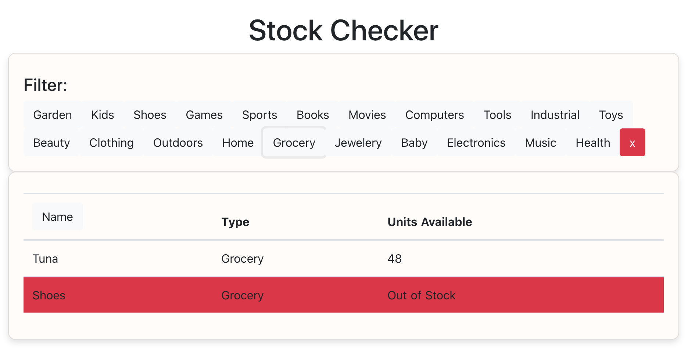

# Stock Checker

Uses a mock stock data api which simulates a delayed and unreliable response.

Check it out here: https://stock-checker-sophieklm.herokuapp.com

Details on the mock data server here: https://github.com/sophieklm/json-server

(The mock data was not built to make any sense, types are very random)

#### Development

Start services in both `/frontend` and `/backend`, instructions for both in their README files.

#### To Do

- Add sorting by Name, Type, Units Available
- Make list items clickable, and open a modal. Modal contains Name, type, and units available, as well as a description.
- Add pagination.
- Monitor stock levels, send a notification when something goes out of stock. Post request to a webhook in Slack. The payload should be a simple json object which contains `{"text":"Panadol is out of stock"}` with dynamic name. Send the payload with header `Content-type: application/json`

